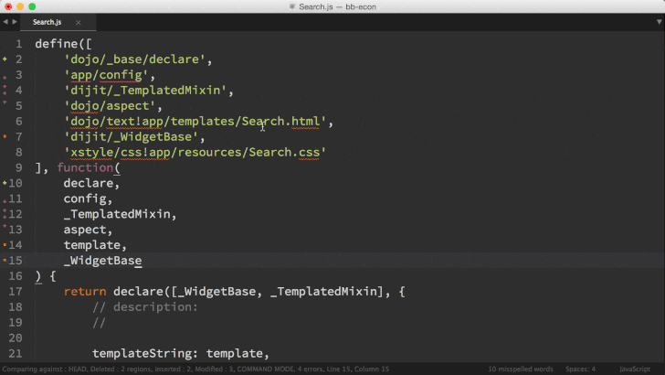
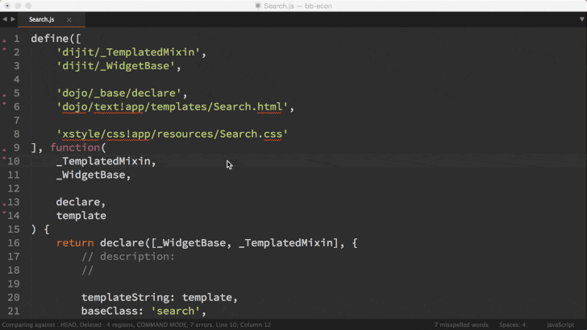
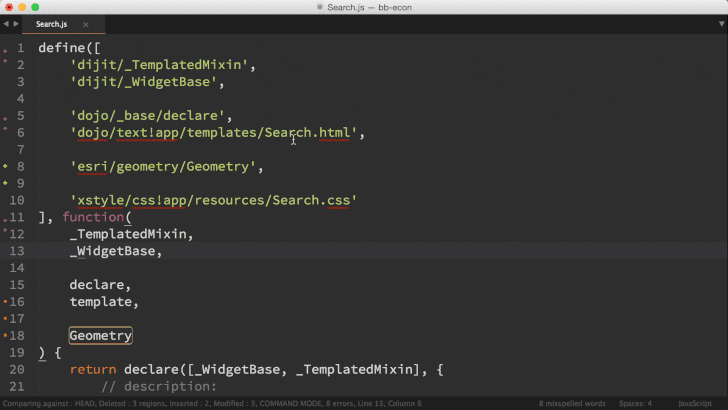

Linux (OSX coming soon) | Windows
------------|------------
 | 

AMD Butler v1.2.2
==========
Serving Up AMD Module Imports

A Sublime Text 3 plugin for managing AMD dependency import statements. It helps you quickly sort, add, and remove AMD import statements. With features such as auto sorting and auto module name discovery it allows you to focus more on your code rather than worrying your AMD imports.

## Commands

#### AMD Butler: Sort AMD Imports
Sorts the existing AMD imports for the current file alphabetically. Packages are separated by a blank line. The corresponding parameter names are also reordered.

#### AMD Butler: Add AMD Import
Searches your packages for possible imports and displays them in the quick panel. When an import is selected it is added to the imports for the current file. The imports for the current file are then sorted.
NOTE: The file that you execute this command from must be a descendant of the [packages folder path](#amd_butler_packages_base_path).

To prevent duplicate, imports that are already in the current file are excluded from the list.

#### AMD Butler: Remove AMD Import
Displays a quick list of all of your current imports. Selecting an import from the quick list removes it from your file. The imports are also automatically sorted.

#### AMD Butler: Refresh Available Imports
Refreshes the cache of available imports for the current view. This can be helpful after creating a new file that you want to import into the current view.

## Installation

#### Via Package Control
The preferred method for installation is via [package control](https://sublime.wbond.net/). First [install package control](https://sublime.wbond.net/installation), then run the "Package Control: Install Package" command and search for "AMD Butler".

#### Manual Install
Clone the [source code](https://github.com/agrc/AmdButler) for this plugin to your Sublime Packages folder.

## Settings
These settings can be set either at the package level (Preferences -> Package Settings -> AmdButler) or at the project level within the [`.sublime-project` file](http://www.sublimetext.com/docs/3/projects.html). 

#### `amd_butler_packages_base_path`
Type: *String*  
The name of the folder containing your AMD packages. This folder is crawled and all files are made available as imports for the "Add AMD Import" command.

*Note:* No manual editing of this setting is needed. The user is prompted for the value if it's not present in either the project or package settings the first time that the "Add AMD Import" or "Refresh Available Imports" commands are run.

#### `amd_butler_params_one_line`
Type: *Boolean*  
If `true`, the params will be rewritten to one line per section (instead of the default (`false`), one line per parameter).

## Contributing
Please match existing code style. 

To execute tests use the [UnitTesting](https://github.com/randy3k/UnitTesting) sublime package.
